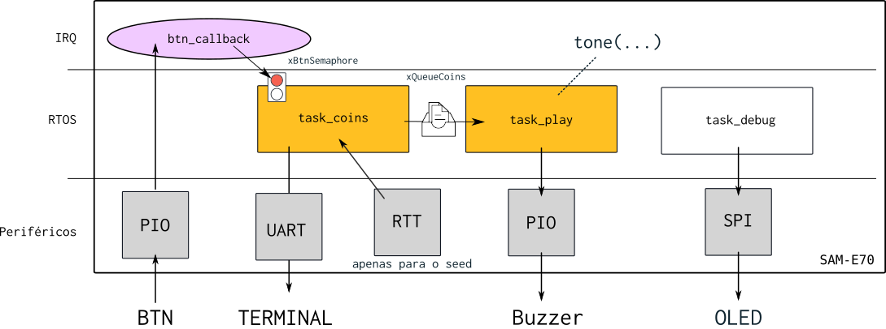

# 23b - AV1 - 

Nessa avaliacao vocês irão recriar um brinquedo de um jogo de tabuleiro do banco imobiliário do Mário (peguei ideia brincando com os meus filhos), este jogo tem um dispositivo que quando apertado indica sonoramente quantas "moedas" o jogador irá ganhar (de forma aleatória). Toda vez que alguém aperta o botão sons são reproduzidos indincando se o jogador vai ganhar: UMA, DUAS ou TRÊS moedas.

https://www.youtube.com/shorts/klZNN5-Mb7w

## Firmware

Vocês devem desenvolver o firmware como indicado a seguir:



- **O código base fornecido é o `RTOS-OLED-Xplained-Pro` já com o RTT adicionado no wizard.**

Filas e semáforos:

- `xBtnSemaphore`: Semáforo que indica que o botão foi apertado
- `xQueueCoins`: Fila de inteiros que recebe um valor entre [1,3] indicando quantas moedas o jogador ganhou

Tasks:

- `task_coins`: Task que recebe a informacão que o botão foi pressionado e calcula quantas moedas o jogador vai ganhar, coloca está informacão na fila `xQueueCoins`.
- `task_coins`: Task que reproduz o som de acordo com quantas moedas vão ser oferecidas para o jogador

Periféricos:

- PIO: Para fazer a leitura do botão e acionar o buzzer
- RTT: Vai ser usado para gerar o seed do gerador de números randômicos

IRQ:

- Callback do botão 

### Gerador de números randômicos

Seria muito ruim se o dispositivo fornecesse sempre a mesma sequência de moedas, pois os jogadores poderiam compreender a dinâmica e antecipar o comportamento do sistema. Para evitar isso, podemos gerar uma sequência aleatória, de modo que, a cada vez que o jogador pressione o botão, o dispositivo produza uma sequência imprevisível para um ser humano.

Para gerarmos uma sequência aleatória, podemos utilizar a função `int rand(void)` disponível na lib ` string.h`. Sempre que essa função é acionada, ela devolve um valor "aleatório" entre `0` e `RAND_MAX`. Contudo, o `rand` necessita ser inicializado com uma semente (`seed`) para produzir números distintos a cada inicialização.

> Você vai ter que limitar o resultado do `rand()` para operar entre [1,3].

A função `srand(int seed)` é responsável por inicializar o `rand()`, de modo que ele possa gerar sequências verdadeiramente aleatórias a cada vez que é chamado. Se sempre utilizarmos a mesma semente, a função `rand()` produzirá a mesma sequência de números aleatórios a cada inicialização. Portanto, uma prática comum é usar algum evento de tempo como semente (que dificilmente vai se repetir), garantindo assim que a sequência gerada seja diferente em execuções distintas.

> **O `srand` deve ser chamado apenas uma vez.**

#### Ideias para o seed

Podemos pensar em algumas soluções para gerarmos o `seed` do `srand`:

1. Tempo em que o sistema ficou ligado até o momento que o botão é apertado pela primeira vez
1. Tempo em que botão fica pressionado pela primeira vez

Você deve ter algo como:

`srand(time)`

Onde o `time` é um valor que depende de um tempo externo e que é imprevisível e "único" cada vez. **O `time` deve ser calculado via uso do `RTT`.**

**Você pode escolher qual abordagem deseja usar.**

### Som

A ideia é reproduzirmos um som similar ao utilizado no jogo do Mário para quando o personagem ganha uma moeda:


Ou seja, devemos reproduzir a nota `B` por `1/8` do tempo e então o `E` pelo resto do tempo para geramos o [som da moeda](https://www.youtube.com/watch?v=8OcSYRAhA9k):

```
tone(NOTE_B5,  80);
tone(NOTE_E6, 640);
```

> Você vai precisar usar a sua função `tone()` da APS1 

## Entrega

Um sistema que reproduz que gera aleatóriamente um valor entre `[1, 3]` utilizando um `seed` que é gerado por um evento de tempo externo e calculado pelo `RTT` e que a cada vez que o jogador aperta o botão o sistema reproduz o som da moeda para cada ponto que o jogador ganhou.

### Check list: funcionalidade

- [ ] Cada vez que o botão é apertado reproduz N vezes o som da moeda, onde 
- [ ] N é um valor aleatório entre `[1, 3]`
- [ ] Som é composto por duas notas 
- [ ] A sequência é aleatória para cada vez que o sistema é inicializado

### Check list: código

- [ ] Obtém uma `seed` usando o `RTT` 
- [ ] Possui duas `task`: `task_coin`, `task_play`
- [ ] `task_coin` inicializa o `srand` com o `seed` (quando obtido)
- [ ] `task_coin` lê o semáforo `xBtnSemaphore` e
- [ ] `task_coin` gera um número aleatório entre `[0,3]` e manda para a fila `xQueueCoins`
- [ ] `botão`: Botão libera o semáforo `xBtnSemaphore`
- [ ] `task_play`: Recebe da fila um valor `n` entre `[0, 3]
- [ ] `task_play`: Reproduz `n` vez a música da moeda
- [ ] `task_play`: Faz uso da função `tone`
